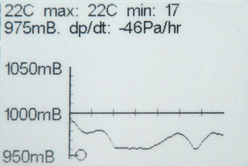
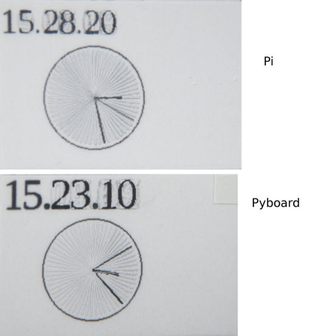

# Ghosting

This only appears in FAST mode, after calling ``refresh()``. The following is an example of a
display from the Pyboard driver in normal mode: no ghosting visible.

This shows the outcome of clock.py on the Pyboard, and raspberry_pi_clock.py on the Pi. In both
cases partial updates are used and ghosting is apparent. It demonstrates that the Pyboard driver
is no worse in this repect than the RePaper reference driver.

Ghosting can be cleared by issuing show() or exchange().
