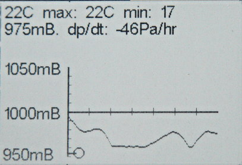

# micropython-epaper

A driver to enable the Pyboard to access a 2.7 inch e-paper display from
[Embedded Artists](http://www.embeddedartists.com/products/displays/lcd_27_epaper.php).
The onboard Flash memory is optionally supported.

The display can also be bought from Mouser Electronics (a company with worldwide depots) e.g.
[MouserUK](http://www.mouser.co.uk/ProductDetail/Embedded-Artists/EA-LCD-009/?qs=sGAEpiMZZMt7dcPGmvnkBrNVf0ehHpp1LPMnQSPTe1M%3d).
Also available in Europe from [Cool Components](http://www.coolcomponents.co.uk).

Support for the Adafruit [module](https://learn.adafruit.com/repaper-eink-development-board)
is provided but limited to the 2.7 inch display module; its onboard flash memory is not currently
supported.

The driver works on the Pyboard Lite but its limited RAM means that the board's use is probably
best confined to simple applications. The driver is fairly demanding on RAM especially in FAST mode
or modes using the Embedded Artists (EA) flash memory. A test of the FAST mode clock demo indicated
that about 50% of the Lite's memory was used.



An open source Python utility is used to create binary and python fonts from
`ttf` or `otf` sources. Python fonts may be frozen as bytecode to conserve RAM,
binary font files are accessed from a mounted drive.

# Introduction

E-paper displays have high contrast and the ability to retain an image with the power
disconnected. They also have very low power consumption when in use. These displays offer
monochrome only, with no grey scale: pixels are either on or off. Further the display refresh takes
time. In normal mode the minimum update time defined by explicit delays is 1.6 seconds. With the
current driver it takes 3.5s. This after some efforts at optimisation. A time closer to 1.6s might
be achieved by writing key methods in Assembler but I have no plans to do this. It is considerably
faster than the Arduino code and as fast (in this mode) as the best alternative board I have seen.

The Embedded Artists (EA) rev D display includes an LM75 temperature sensor and a 4MB flash memory
chip. The driver provides access to the current temperature. The display driver does not use the
flash chip: the current image is buffered in RAM. An option is provided to mount the flash device
in the Pyboard's filesystem enabling it to be used to store data such as images and fonts. This is
the `use_flash` Display constructor argument. Setting this `False` will save over 8K of RAM. The
primary application for the onboard flash is in ultra low power applications where the consumption
of an SD card would be excessive.

An issue with the EA module is that the Flash memory and the display module use the SPI bus in
different, incompatible ways. The driver provides a means of arbitration between these devices
discussed below. This is transparent to the user of the Display class. A consequence of this is
that the SPI bus used by the display should not be shared with other devices.

One application area for e-paper displays is in ultra low power applications. The Pyboard 1.1 in
standby mode consumes about 7μA. To avoid adding to this an external circuit is required to turn
off the power to the display and any other peripherals before entering standby. A way of achieving
this is presented [here](https://github.com/peterhinch/micropython-micropower.git).

This driver was ported from the RePaper reference designs [here](https://github.com/repaper/gratis.git).
There are two reference drivers, one for resource constrained platforms (Arduino library) and
another for systems with an OS. The latter attempts faster screen writes by employing a double
buffered algorithm. This MicroPython driver supports both modes. By default it uses the resource
constrained "NORMAL" single buffered mode: the downside is slower updates with repeated black-white
screen transitions.

"FAST" mode is intended for display of (fairly) realtime data. It uses more RAM and also precludes
the concurrent use of the display and its onboard Flash memory. The following instructions largely
refer to NORMAL mode. FAST mode is a superset with features covered in a separate section below. In
this mode the fastest update method causes the display to exhibit some "ghosting" where a trace of
the prior image remains. After much effort to reduce this I'm doubtful whether further progress can
be made without departing from the RePaper reference algorithms.

# The driver

This enables the display of simple graphics and/or text in any font. Font files
are created using the `font_to_py.py` [utility](https://github.com/peterhinch/micropython-font-to-py.git).
This PC utility converts industry standard `ttf` or `otf` files to formats
compatible with the driver. The graphics capability may readily be extended by
the user.

The driver also supports the display of XBM format graphics files, including
the full screen sample images from Embedded Artists.

# Connecting the display

### Embedded Artists hardware

The display is supplied with a 14 way ribbon cable. The easiest way to connect it to the Pyboard is
to cut this cable in half and wire one half of it (each half is identical) as follows. I fitted the
Pyboard with socket headers and wired the display cable to a 14 way pin header, enabling it to be
plugged in to either side of the Pyboard (the two sides are symmetrical). I have labelled them L
and R indicating the left and right sides of the board as seen from the component side with the USB
connector at the top.

| display | signal     |  L  |  R  | Python name   |
|:-------:|:----------:|:---:|:---:|:-------------:|
|  1      | GND        | GND | GND |               |
|  2      | 3V3        | 3V3 | 3V3 |               |
|  3      | SCK        | Y6  | X6  | (SPI bus)     |
|  4      | MOSI       | Y8  | X8  |               |
|  5      | MISO       | Y7  | X7  |               |
|  6      | SSEL       | Y5  | X5  | Pin_EPD_CS    |
|  7      | Busy       | X11 | Y11 | Pin_BUSY      |
|  8      | Border Ctl | X12 | Y12 | Pin_BORDER    |
|  9      | SCL        | X9  | Y9  | (I2C bus)     |
| 10      | SDA        | X10 | Y10 |               |
| 11      | CS Flash   | Y1  | X1  | Pin_FLASH_CS  |
| 12      | Reset      | Y2  | X2  | Pin_RESET     |
| 13      | Pwr        | Y3  | X3  | Pin_PANEL_ON  |
| 14      | Discharge  | Y4  | X4  | Pin_DISCHARGE |

The SPI bus is not designed for driving long wires. This driver uses it at upto 10.5MHz so keep
them short!

Red stripe on cable is pin 1.

For information this shows the E-paper 14 way 0.1inch pitch connector as viewed looking down on the
pins with the keying cutout to the left:

|  L |  R |
|:--:|:--:|
|  1 |  2 |
|  3 |  4 |
|  5 |  6 |
|  7 |  8 |
|  9 | 10 |
| 11 | 12 |
| 13 | 14 |

### Adafruit hardware

The Adafruit module is supplied with a cable: colours below refer to this.

| Display   | signal     |  L  |  R  | Python name   |
|:---------:|:----------:|:---:|:---:|:-------------:|
| 20 black  | GND        | GND | GND |               |
|  1 red    | 3V3        | 3V3 | 3V3 |               |
|  7 yellow | SCK        | Y6  | X6  | (SPI bus)     |
| 15 blue   | MOSI       | Y8  | X8  |               |
| 14 purple | MISO       | Y7  | X7  |               |
| 19 brown  | SSEL       | Y5  | X5  | Pin_EPD_CS    |
|  6 green  | Temp       | X11 | Y11 | Temperature   |
| 13 grey   | Border Ctl | X12 | Y12 | Pin_BORDER    |
|           | (n/c)      | X9  | Y9  |               |
|  8 orange | Busy       | X10 | Y10 | Pin_BUSY      |
| 18 orange | CS Flash   | Y1  | X1  | Pin_FLASH_CS  |
| 10 black  | Reset      | Y2  | X2  | Pin_RESET     |
| 11 red    | Pwr        | Y3  | X3  | Pin_PANEL_ON  |
| 12 white  | Discharge  | Y4  | X4  | Pin_DISCHARGE |

Looking at the board oriented display side up and connector on the left, Pin 1 is the top left pin
(the left column are all odd numbered pins) and pin 2 is immediately to its right (right hand
column is all the even pins). There is also small 1 and 2 on the PCB silk screen above the socket
and a 19 and 20 below the socket.

# Getting started

Copy the mandatory modules listed below to the Pyboard. Assuming the device is
connected on the 'L' side simply cut and paste this at the REPL. Note that with
all code samples it's best to issue `<ctrl>D` before pasting to reset the
Pyboard: this is because the driver needs to instantiate large buffers. Memory
allocation errors are likely unless RAM is first cleared by a soft reset. Note
that all the following code samples assume EA hardware: if using Adafruit add
`mode=epaper.ADAFRUIT` as a constructor argument.

```python
import epaper
a = epaper.Display('L')
a.rect(20, 20, 150, 150, 3)
a.show()
```

To clear the screen and print a message (assuming we are using an SD card):

```python
a.clear_screen()
with a.font('/sd/courier25'):
    a.puts("Large font\ntext here")
a.show()
```

The above example assumes a binary font file on the SD card. If a Python font module (frozen
or otherwise) were used suitable code would be as follows:

```python
import pyb, epaper, courier25
a = epaper.Display(side = 'L')
with a.font(courier25):
    a.puts('Text here')
a.show()
```

# Modules

To employ the driver it is only necessary to import the epaper module and to
instantiate the `Display` class. The driver comprises the following modules.  

Mandatory modules:  
 1. `epaper.py` The user interface to the display and flash memory.
 2. `epd.py` Low level NORMAL mode driver for the EPD (electrophoretic display).
 3. `panel.py` Pin definitions for the display.  

Optional modules:  
 4. `epdpart.py` Low level FAST mode driver for the EPD.  
 5. `flash.py` Low level driver for the flash memory.

Note that the flash drive will need to be formatted before first use: see the
`flash.py` doc below.

# Files and Utilities

`LiberationSerif-Regular44` Sample binary font file (Times Roman lookalike).  
`courier25` 25 pixel high terminal font (binary font file).  
`LiberationSerif-Regular44.py` Above files in Python format
`courier25.py`  
`aphrodite_2_7.xbm` Sample full screen image files from Embedded Artists.  
`cat_2_7.xbm`  
`ea_2_7.xbm`  
`saturn_2_7.xbm`  
`text_image_2_7.xbm`  
`venus_2_7.xbm`
`SIL Open Font License.txt` License for fonts.

# Module epaper.py

This is the user interface to the display, the flash memory and the temperature sensor. Display
data is buffered. The procedure for displaying text or graphics is to use the various methods
described below to write text or graphics to the buffer and then to call `show()` to
display the result. The `show()` method is the only one to access the EPD module (although
`clear_screen()` calls `show()`). Others affect the buffer alone.

The coordinate system has its origin at the top left corner of the display, with integer
X values from 0 to 263 and Y from 0 to 175 (inclusive).

In general the graphics code prioritises simplicity over efficiency: e-paper displays are far
from fast. But I might get round to improving the speed of font rendering which is particularly
slow when you write a string using a large font (frozen fonts are faster). In the meantime be
patient. Or offer a patch :)

## Display class

### Constructor

This has one positional argument:  
 1. `side` This must be 'L' or 'R' depending on the side of the Pyboard in use. Default 'L'. This
 is based on the wiring notes above.
It has the following keyword only arguments:  
 2. `mode` `epaper.NORMAL` or `epaper.FAST` - default normal mode.
 3. `model` `epaper.EMBEDDED_ARTISTS` or `epaper.ADAFRUIT`. Default EA.
 4. `use_flash` Mounts the flash drive as /fc for general use. Default False. N/A in FAST mode.
 5. `up_time` Applies to FAST mode only. See below.

### Methods

`clear_screen()` Clears the screen. Argument `show` Default True. This blanks the screen buffer
and resets the text cursor. If `show` is set it also displays the result by calling the
`show()` method.  

`show()` Displays the contents of the screen buffer.  

`line()` Draw a line. Arguments `X0, Y0, X1, Y1, Width, Black`. Defaults: width = 1 pixel,
Black = True.  

`rect()` Draw a rectangle. Arguments `X0, Y0, X1, Y1, Width, Black`. Defaults: width = 1 pixel,
Black = True.  

`fillrect()` Draw a filled rectangle. Arguments `X0, Y0, X1, Y1, Black`. Defaults: Black = True.  

`circle()` Draw a circle. Arguments `x0, y0, r, width, black`. Defaults: width = 1 pixel,
Black = True. x0, y0 are the coordinates of the centre, r is the radius.  

`fillcircle()` Draw a filled circle. Arguments `x0, y0, r, black`. Defaults: Black = True.  

`load_xbm()` Load an image formatted as an XBM file. Arguments `sourcefile, x0, y0`: Path
to the XBM file followed by coordinates defaulting to 0, 0.  

`loadgfx()` Fill a rectangular area with a bitmap. Arguments: `gen, width, height, x0, y0` where
gen is a generator supplying bytes for each line in turn. These are displayed left to right, LSB of
the 1st byte being at the top LH corner. Unused bits at the end of the line are ignored with a new
line starting on the next byte.

`locate()` This sets the pixel location of the text cursor. Arguments `x, y`.  

`puts()` Write a text string to the buffer. Argument `s`, the string to display. This must
be called from a `with` block that defines the font; text will be rendered to the pixel location
of the text cursor. Newline characters and line wrapping are supported. Example usage:

```python
with a.font('/sd/LiberationSerif-Regular45x44'):
   a.puts("Large font\ntext here")
a.show()
```

`setpixel()` Set or clear a pixel. Arguments `x, y, black`. Checks for and ignores pixels not
within the display boundary.  
`setpixelfast()` Set or clear a pixel. Arguments `x, y, black`. Caller must check bounds. Uses
the Viper emitter for maximum speed.

The following methods are primarily for internal use and should not be used in normal operation as
in this case the flash device is mounted automatically.

`mountflash()` Mount the flash device.  
`umountflash()` Unmount the flash memory.  

### Properties

`temperature` Returns the current temperature in degrees Celsius.  
`location` Returns the x, y coordinates of the text cursor.

## Font class

This is a Python context manager whose purpose is to define a context for the display's `puts()`
method described above. It ensures that any font file is closed after use. It has no user
accessible properties or methods. A font is instantiated for the duration of outputting one or more
strings. It must be provided with the path to a valid binary font file or the name of a frozen
font. See the code sample above.

By default fonts are proportional. Where true monospaced output is required, for best results a
non-proportional font should be used. It can then be employed as follows (`a` is a `Display`
instance):

```python
a.clear_screen()
with a.font('/sd/courier25', monospaced = True):
    a.puts("Large font\ntext here")
a.show()
```

The `monospaced` argument, which can be used with font files or Python font modules, will force
any font to be rendered with fixed spacing. Results are unlikely to be visually pleasing unless the
font is designed for such rendering.

In the interests of conserving scarce RAM, font files use a binary format. Individual
characters are buffered in RAM as required. This contrasts with the conventional approach of
buffering the entire font in RAM, which is faster. The EPD is not a fast device and RAM is
in short supply, hence the design decision. This is transparent to the user.

With frozen fonts the fonts are stored in Flash as part of the device firmware. This enables them
to be accessed as a `bytes` instance with faster operation. It uses even less RAM than file
access at the cost of having to build the firmware from source.

# Module epd.py

This provides the low level interface to the EPD display module in NORMAL mode. It provides two
methods and one property accessed by the `epaper` module:

### Methods

`showdata()` Displays the current text buffer  
`clear_data()` Clears the buffer without displaying it.

# Module epdpart.py

This provides the low level interface to the EPD display module in FAST. Its interface is a
superset of that of `epd.py` providing two additional methods:

`refresh()` Fast update using current data buffer.
`exchange()` A faster alternative to `showdata`.

# Module flash.py

This provides an interface to the 4MB flash memory on the Embedded Artists
display; its use is entirely optional. Its most likely use is in ultra low
power applications where the Pyboard runs without an SD card.

It supports the ioctl protocol enabling the flash device to be mounted on the
Pyboard filesystem and used for any purpose. There is a compromise in the
design of this class between RAM usage and flash device wear. The compromise
chosen is to buffer the two most recently written sectors: this uses 8K of RAM
and substantially reduces the number of erase/write cycles, especially for low
numbered sectors, compared to a naive unbuffered approach. The anticipated use
for the flash is for storing rarely changing images and fonts so I think the
compromise is reasonable.

Buffering also improves perceived performance by reducing the number of
erase/write cycles.

## Getting Started

The flash drive must be formatted before first use. The code below will do this, and demonstrates
copying a file to the drive (assuming you have first put the file on the SD card - modify this for
any available file).

```python
import pyb, flash, uos
f = flash.FlashClass(0) # If on right hand side pass 1
vfs = uos.VfsFat(f)
vfs.mkfs(f) # To create a new filesystem (will erase any existing contents)
uos.mount(vfs, f.mountpoint)
flash.cp('/sd/LiberationSerif-Regular44','/fc/')
uos.listdir('/fc')
uos.umount('/fc')
```

## File copy

A rudimentary `cp(source, dest)` function is provided as a generic file copy routine. The first
argument is the full pathname to the source file. The second may be a full path to the destination
file or a directory specifier which must have a trailing '/'. If an OSError is thrown (e.g. a
non-existent source file) it is up to the caller to handle it.

## FlashClass

### Constructor

`FlashClass()` This takes one argument `intside` Indicates whether the device is mounted on the
left (0) or right hand (1) side of the Pyboard (as defined above).

### Methods providing the ioctl protocol

For the protocol definition see
[the pyb documentation](http://docs.micropython.org/en/latest/library/pyb.html)

`readblocks()`  
`writeblocks()`  
`ioctl()`  

### Other methods

The following methods are available for general use.  
`available()` Returns True if the device is detected and is supported.  
`info()` Returns manufacturer and device ID as integers.  
`begin()` Set up the bus and device. Throws a FlashException if device cannot be validated.  
`end()` Sync the device then shut down the bus.  

Other than for debugging there is no need to call `available()`: the constructor will throw
a `FlashException` if it fails to communicate with and correctly identify the chip.

### SPI bus arbitration

This information is provided for those wishing to modify the code. The Embedded Artists device
has a flash memory chip (Winbond  W25Q32 32Mbit chip) which shares the SPI bus with the display
device (Pervasive Displays EM027BS013). These use the bus in different incompatible ways,
consequently to use the display with the flash device mounted requires arbitration. This is done in
the Display class `show()` method. Firstly it disables the Flash memory's use of the bus with
`self.flash.end()`. The EPD class is a Python context manager and its appearance in a `with`
statement performs hardware initialisation including setting up the bus.

On completion of the `with` block the display hardware is shut down in an orderly fashion and
the bus de-initialised. The flash device is then re-initialised and re-mounted. This works because of
the buffered nature of the display driver: the flash chip is used for operations which modify the
buffer but is not required for the display of the buffer contents.

# Module panel.py

This simply provides a dictionary of pin definitions enabling the panel to be installed on either
side of the Pyboard.

# Fonts

Fonts can be handled in two ways. The first employs binary font files located on any accessible
drive including the flash device on the display. The second involves creating a Python script which
includes the font data and implementing this as persistent bytecode. The font then resides on the
Pyboard in flash memory as part of the firmware. These approaches are described below.

Font files are created using the `font_to_py.py` [utility](https://github.com/peterhinch/micropython-font-to-py.git).
This runs on a PC and converts industry standard `ttf` or `otf` files to Python source or to
binary format. The following examples assume you want to produce a 44 pixel high font, in the
first case a binary file (`-b` argument) and in the second a Python source file.

```
./font_to_py.py LiberationSerif-Regular.ttf 44 -xrb lib-serif44
./font_to_py.py LiberationSerif-Regular.ttf 44 -xr lib-serif44.py
```

The -xr options must be specified. There is no need to specify -f (fixed spacing). The best
approach to fixed width fonts is to use one such as Courier designed as such. Any font may be
rendered as fixed pitch by specifying the `monospaced` option as described above.

Only Python source can be frozen as bytecode. Instructions as to how to do this are available on
the MicroPython site, but in essence it involves putting the files to be frozen in a common
directory and compiling the source with an option specifying the directory. The build is then
flashed in the normal way. To test success (assuming a font called `myfont`) ensure that
`myfont` does not exist on the device's filesystem and issue

```
import myfont
```

If no `ImportError` is thrown, `fonts.py` is frozen in the firmware.

# Micropower Support

A major application for e-paper displays is in devices intended to run for long periods from
battery power. To achieve this, external hardware can be used to ensure power to the display and
other peripherals is removed when the Pyboard is in standby. On waking the program turns on power
to the peripherals, turning it off before going back into standby. For the lowest possible
consumption an SD card should not be installed on the Pyboard as this consumes power at all times.
Fonts and images should be stored in the Pyboard flash memory or on an external device whose power
is switched (such as the flash memory on a power-switched display).

Full details of how to achieve this are provided
[here](https://github.com/peterhinch/micropython-micropower.git).

Note that there are two ways of conserving space on the Pyboard flash drive by incorporating Python
code into firmware. Both are based on the fact that the bulk of the flash memory is accessible to
firmware images but is not accessible as part of the `/flash` filesystem. Modules can be frozen
as .py files or compiled to bytecode and built into the firmware as persistent bytecode. The former
method is currently required for code which employs Viper, Native or Assembler decorators. This
includes epd.py, epdpart.py and epaper.py.

# FAST mode

The graphics and text primitives operate identically in both modes: a buffer is updated without
affecting the display. Then a `Display` method is called to update the display hardware; FAST
mode offers two additional update methods.

The mode is invoked by instantiating the Display object with `mode=epaper.FAST`. In this mode the
`Display` instance must be used within a context manager: this turns on the display electronics and
ensures they are properly shut down. A consequence of this mode of operation is that the onboard
Flash cannot be used while this context is active, so fonts must be stored elsewhere. The following
additional `Display` methods are supported:

`refresh()` Quickly updates the display additively: existing content will be retained but new
content will be included (overwriting the old where they overlap). Currently this is imperfect with
some ghosting evident.

`exchange()` This takes a single mandatory boolean argument `clear_data`. Display data is
double buffered. Calling `exchange` causes the current data to be displayed and the buffers to be
swapped. If `clear_data` is `True` the new current buffer is cleared: this enables it to act as
a faster version of `show()`. If `clear_data` is `False` it provides a means of switching
between two images. Ghosting should not be visible with this method.

The `Display` constructor has an additional kwonly argument `up_time` applicable to
FAST mode. If set it overrides the default temperature related value allowing the user to speed
redrawing at the likely expense of more ghosting. Its value is in ms: if not overridden its value
ranges between 630-1260ms at typical room temperatures.

The following example illustrates FAST mode by means of a simple digital clock display - some
ghosting is evident. Note the additional two spaces at the end of the text: if refreshing
proportional fonts the physical length of the text string varies. This can lead to the rightmost
pixels of the previous string failing to be overwritten unless monospaced fonts are used with the
`monospaced` context manager argument described above.

```python
import epaper, time
a = epaper.Display('L', mode = epaper.FAST)
with a:
    a.clear_screen()
    while True:
        t =time.localtime()
        with a.font('/sd/LiberationSerif-Regular45x44'):
            a.locate(0,0)
            a.puts('{:02d}.{:02d}.{:02d} '.format(t[3],t[4],t[5]))
            a.refresh()
        time.sleep(2)
```

This example (`clock.py`) has digital and analog displays and better illustrates the issue of
ghosting. A similar demo run on the Raspberry Pi with the reference driver resulted in an identical
amount of ghosting. [Reference](./GHOSTING.md)

```python
import epaper, time, math, pyb, gc
a = epaper.Display('L', mode = epaper.FAST)

def polar_line(origin, length, width):
    def draw(radians):
        x_end = origin[0] + length * math.sin(radians)
        y_end = origin[1] - length * math.cos(radians)
        a.line(origin[0], origin[1], x_end, y_end, width, True)
    return draw

origin = 100, 100
secs = polar_line(origin, 50, 1)
mins = polar_line(origin, 50, 2)
hours = polar_line(origin, 30, 4)

with a:
    a.clear_screen()
    while True:
        a.clear_screen(False) # Clear data
        a.circle(origin[0], origin[1], 55, 1)
        t = time.localtime()
        h, m, s = t[3:6]
        hh = h + m /60
        with a.font('/sd/LiberationSerif-Regular45x44'):
            a.locate(0,0)
            a.puts('{:02d}.{:02d}.{:02d}'.format(h, m, s))
        secs(2 * math.pi * s/60)
        mins(2 * math.pi * m/60)
        hours(2 * math.pi * (h + m/60)/12)
        a.refresh()
        gc.collect() # especially on PB Lite
```

### For experimenters

The `refresh` method has a boolean argument `fast`, defaulting `True`. Setting this `False`
invokes a slower method claimed by some developers to reduce ghosting. Under investigation; I'm
underwhelmed so far. The code (epdpart.py) has web references in the comments.

# RAM usage

As mentioned in "Getting started" the driver uses a significant amount of RAM, especially in FAST
mode. In development, issue `<ctrl>D` before importing and instantiating the Display. In code which
is to run unattended, instantiate the Display early to ensure it can obtain contiguous RAM blocks
for its buffers. With code such as this which employs a lot of RAM, heap fragmentation can become
more of an issue than usual. To avoid allocation failures issue gc.collect() periodically, notably
after any large object goes out of scope.

# Legalities

The EPD and Flash driver code is based on C code released under the Apache licence. Accordingly I
have released this code under the same licence and included the original copyright headers in the
source. If the copyright owner has any issues with this I will be happy to accommodate any requests
for changes.

# References

This code is derived from that at [Embedded Artists](https://github.com/embeddedartists/gratis).  
Graphics code derived from [ARM mbed](https://developer.mbed.org/users/dreschpe/code/EaEpaper/).  
[RePaper reference designs](https://github.com/repaper/gratis.git).  
[Ideas on ultra low power Pyboard systems](https://github.com/peterhinch/micropython-micropower.git).

Further sources of information:  
[device data and interface timing](http://www.pervasivedisplays.com/products/27).  
[COG interface timing](http://www.pervasivedisplays.com/_literature_220873/COG_Driver_Interface_Timing_for_small_size_G2_V231).  
[Flash device data](http://www.elinux.org/images/f/f5/Winbond-w25q32.pdf) (EA device only).  
[RePaper](http://repaper.org/doc/cog_driving.html).

Fonts acquired from [fontsquirrel](https://www.fontsquirrel.com/).

Notes on the font file layout are available [here](https://github.com/peterhinch/micropython-samples/blob/master/font/README.md).
