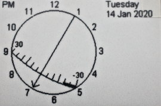
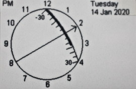

I'm rarely impressed by alternative clock displays firstly because the
traditional analog design is so damn good. You can tell the time at a glance
just from the angle between the two hands: how can you improve on that? But
then I found
[this bizarre watch display](http://hinch.me.uk/newclock/watch.mp4) on the
internet.

Hard to realise on a mechanical watch ;) but interesting. And it got me
thinking. This repo has analog and digital clocks on the e-paper display. In
theory e-paper should be ideal for clocks with exceptionally low power
consumption: zero if you switch them off! Results were poor as there are two
choices. Either you refresh the display normally, in which case every (say) 1
minute the screen goes through a five second rigmarole to update. Or you use
fast updates, in which case you get ghosting.

E-paper displays in fast mode are additive. Ghosting only occurs when you turn
a black pixel white. I therefore devised this adaptation of the video which
only turns pixels white with a full refresh once per hour.

As in the video the display inside the circle is a window onto a dial too large
to fit the screen. The dial is the minutes display, with a range of +-30
minutes. The hour hand (chevron) moves to the next hour when the minutes pass
30, with the minutes before or after the hour shown by the black band on the
scale.

The above image shows 20 to 7 PM, that below shows nearly quarter past 2 PM.
Like a conventional analog clock it encourages reading the display in the way
in which we normally describe time.

Implemented on a Pyboard 1.x with Pervasive Displays EPD.

This demo will need minor adaptation to run. The `micropower` import is only
required for my hardware, to turn on power to the display.
