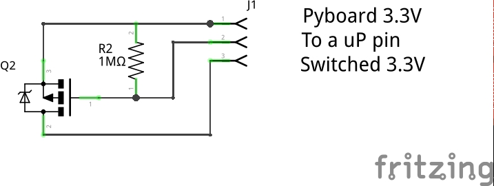
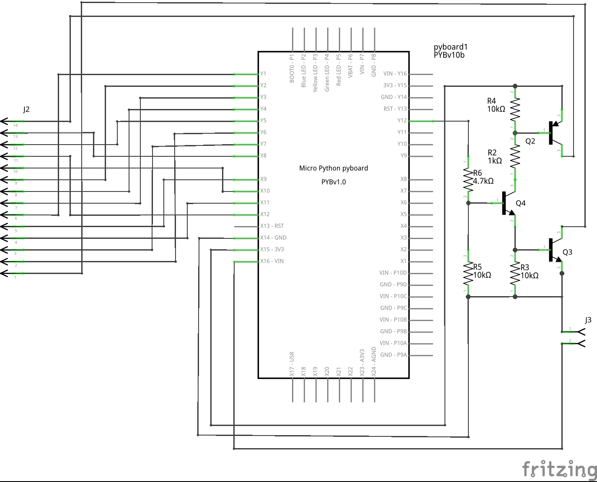

# Support for minimising standby current of Pyboard based systems

These notes describe a few general points in achieving minimum power draw from Pyboard based systems. A
circuit design and PCB layout are offered for achieving this with external chips or modules. It was specifically
designed for the e-paper display, but could readily be used with other devices.

When in standby mode the current drawn by the MPU drops to some 4uA. The Pyboard as a whole draws typically
30uA largely owing to the onboard LDO voltage regulator which cannot be disabled. A typical application will
use code along these lines:

```python
import pyb, stm
rtc = pyb.RTC()

usb_connected = pyb.Pin.board.USB_VBUS.value() == 1
if not usb_connected:
   pyb.usb_mode(None) # Save power

if stm.mem32[stm.RTC + stm.RTC_BKP1R] == 0:     # first boot
   rtc.datetime((2015, 8, 6, 4, 13, 0, 0, 0))   # Code to run on 1st boot only

 # code to run every time
rtc.wakeup(20000)
stm.mem32[stm.RTC + stm.RTC_BKP1R] = 1 # indicate that we are going into standby mode
if not usb_connected:
   pyb.standby()
```
The usb_connected logic simplifies debugging using a USB cable while minimising power when run without USB. The
first boot detection is a potentially useful convenience.

# Hardware issues

Most practical applications will have hardware peripherals attached, connected to Pyboard GPIO pins and the
various Pyboard interfaces. To conserve power these should be powered down when the Pyboard is in standby,
and the Pyboard provides no means of doing this. In many cases the solution is as simple as this



Initially the code drives the pin low, then drives it high before entering standby. In this state the GPIO
pins go high impedance, so the MOSFET remains off by virtue of the resistor.

Unfortunately this is inadequate for devices using the I2C bus or using its pins as GPIO. This is because
the Pyboard has pullup resistors on these pins which are likely to source current into the connected hardware
even when the latter is powered down. There are two possible solutions. The first is to provide switches in
series with the relevant GPIO pins. The second is to switch both Vdd and Vss of the connected hardware. I
have adopted the latter approach. The current consumed by the connected hardware when the Pyboard is in
standby is effectively zero, with the total current draw being 29uA. This (from datasheet values) comprises
4uA for the microprocessor and 25uA for the LDO regulator.

# Design details

This was dictated by my inability to solder SMD devices owing to age and health issues. I failed to source
suitable MOSFETs so the circuit is based on bipolar TO92 transistors. There is an increase in component
count, but the parts are inexpensive. I wanted a circuit driven from a single GPIO pin to guarantee that
the Vss line could never be turned off while Vdd was driven high: I suspect that some connected equipment
would dislike this condition.

The design is capable of sourcing at least 30mA, although R2 could be reduced to drive the output
transistors harder. But this is intended for low power applications. It consumes about 2mA when on
(the Pyboard will typically be consuming 60mA when working). Its off consumption is effectively zero.



An editable version, with a PCB designed to simplify connectivity to the epaper display, is provided in
the file epd.fzz - this requires the free (as in beer) software from [Fritzing](http://fritzing.org/home/)
